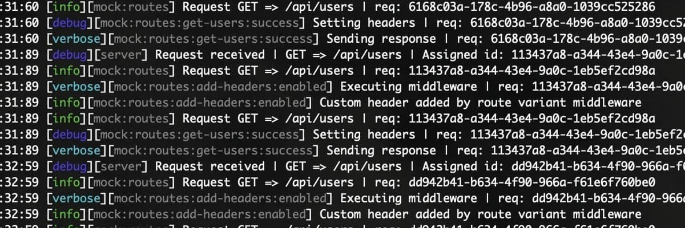
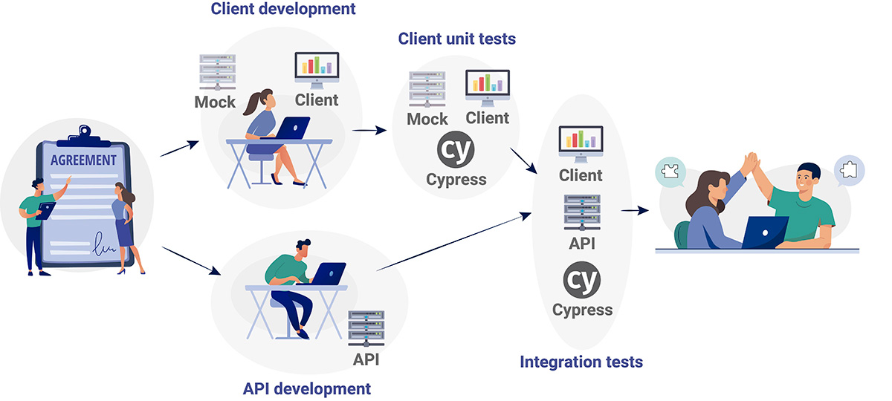
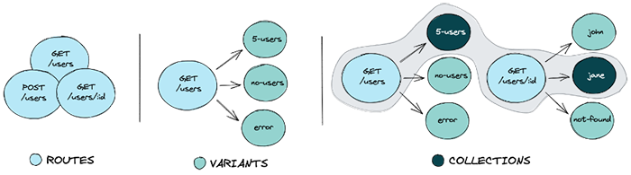
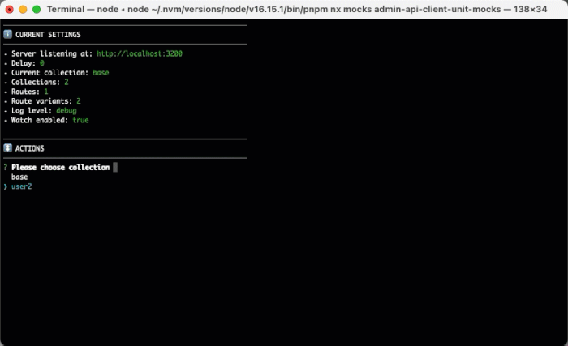

## Why to use a mock server with Cypress?

When testing front-end applications using Cypress, we usually need to __mock API responses in certain testing phases__. Talking about testing phases deserves another post, but in this one we are going to suppose that we are in a testing phase in which we are testing the front-end application in the browser, but without the dependency of the real API services. So, it could be like __testing unitary the whole application__.

Cypress provides itself some mechanisms allowing to mock API responses in the website under its control, as the [`cy.intercept` command](https://docs.cypress.io/api/commands/intercept). It is a great Cypress feature that, apart from stubbing the API responses, it also allows to spy the requests and write assertions related to them.

So, if Cypress already provides a mechanism to simulate API responses, why should we need a mock server? Well, the Cypress features are limited to its usage on Cypress, and, __using a separated mock server allows us to reuse the same API mock for other purposes, such as simulating the API while we are developing the application__, execute contract tests between the API mock and the OpenApi definition to ensure that we are accomplishing the API contract, etc.

We could even use a combination of both techniques, and write assertions about the API requests that our app is performing using the `cy.intercept` command while the responses are sent by our mock server.

## Workflow

So, we can start the development by making an agreement about the API contract before it is developed. Then, using a mock server will allow us to create an API mock based on the API contract, and control the responses of the API during the development and the "unitary" testing with Cypress.

> * Controlling the responses of the API will improve the development workflow, avoiding early dependencies with the team developing the API. It also improves the testing of error cases or another cases that are commonly hard to reproduce with a real API.
> * Defining the API responses during the earliest phases of development will improve the communication among team members and align their expectations.



## Mock server

In this tutorial we are going to use [Mocks Server](https://www.mocks-server.org/). It is a Node.js mock server running live, interactive mocks in place of real APIs. __It makes able to define many different responses for a same route__, so, we can change the whole mocked API behavior by simply changing the response of one or many routes while the server is running.

It also __allows to create collections defining the specific responses to be sent by each different route__, and the user can choose which collection has to be used on each particular moment. This makes able to store multiple collections and change the whole API behavior by simply changing the current one. So, suppose that we are testing a books store application, then we could store collections as "books-with-long-name", "get-book-error", "empty-category", etc. __Each collection can change at a time many API responses, so it can simulate a specific API state useful for executing some specific tests__.

And, more interesting even (given that we are talking about Cypress), __it provides Cypress commands to change the current routes collection or the responses of specific routes while the server is running__.



## Installation

Mocks Server is essentially a set of NPM packages. For using it with Cypress, we should install `@mocks-server/main` and `@mocks-server/cypress-commands`:

```shell
npm i -D @mocks-server/main @mocks-server/cypress-commands
```

Then, you can add a NPM script that will allows to start the mock server using the command line interface:

```json
{
  "scripts": {
    "mocks" : "mocks-server"
  }
}
```

This enables to start the mock server by simply running a command in the project folder:

```shell
npm run mocks
```

About the Mocks Server Cypress commands, we need to register them on Cypress. At the top of your Cypress' support file (usually `cypress/support/e2e.js` for e2e testing type):

```js
import { register } from "@mocks-server/cypress-commands";
register();
```

## Basic usage

__When Mocks Server is started, the interactive CLI is displayed by default__. It allows you to see some details about the current configuration. Using the arrow keys and the `Return` key you can choose menu options in order to perform some actions, like changing the current collection, setting a delay time for the server responses, etc.



__This interactive CLI is a great tool for controlling the mock server while you are in the development phase__, because it allows to change the server responses in real time using it without modifying any code.

When the server is started for the first time, __it creates a configuration file and a scaffold folder containing some examples of routes and collections__.

```
project-root/
├── mocks/
│   ├── routes/ <- DEFINE YOUR ROUTES HERE
│   │   ├── common.js
│   │   └── users.js
│   └── collections.json <- DEFINE YOUR COLLECTIONS HERE
└── mocks.config.js <- DEFINE YOUR CONFIGURATION HERE
```

* The server loads all files in the `mocks/routes` folder, which must contain the [route definitions](https://www.mocks-server.org/docs/usage/routes).
* The `mocks/collections.json` file is used to define [collections](https://www.mocks-server.org/docs/usage/collections) of [route variants](https://www.mocks-server.org/docs/usage/variants).
* The server watches for changes in all files in the `mocks` folder, so changing a file will immediately update the responses of the mocked API.

> Note: In this section we are not going to learn deeper how to use Mocks Server, because we want to focus on its usage with Cypress, so, __[you can refer to its own documentation for further info](https://www.mocks-server.org)__.

## Starting the app, the mock server and Cypress

Now we already have our mock server installed and we can start it using a command. This allows to start the mock server manually when starting the application and opening Cypress in headed mode by simply running three separated processes in three terminals.

Supposing that we have next commands in the `package.json` file:

```json
{
  "scripts": {
    "start:app": "react-app-rewired start",
    "cypress:open": "cypress open",
    "mocks" : "mocks-server"
  }
}
```

We could start the processes separately and control each one on its own terminal.

_Start the web application:_
```shell
npm run start:app
```

_Start the mock server:_
```shell
npm run mocks
```

_Open Cypress in headed mode:_
```shell
npm run cypress:open
```

For the moment, this is all we need to have a look at the Mocks Server Cypress commands. In [another section of this post](#starting-all-using-a-single-command) we will figure out how to start all processes using a single command to be able to run the tests on a CI pipeline.

## Changing the responses of the API mock

Now that we have the mock server running, our web application started _(and, of course, configured to use the mock server as its API)_, and Cypress opened, we can start using the `@mocks-server/cypress-commands` package to change the responses of the API and test different scenarios in the app.

Suppose that we are testing a books store app. In Mocks Server we have one collection of routes simulating that the books catalogue contains two elements, and another one simulating that it is empty. We have named those collections _"two-books"_ and _"no-books"_. Then, we could write two different tests, one for each case:

```js
describe("books page", () => {
  describe("when there are two books", () => {
    before(() => {
      cy.mocksSetCollection("two-books"); // Use "two-books" collection
      cy.visit("/");
    });

    it("should display two books", () => {
      cy.get("#books li").should("have.length", 2);
    });
  });

  describe("when there are no books", () => {
    before(() => {
      cy.mocksSetCollection("no-books"); // Use "no-books" collection
      cy.visit("/");
    });

    it("should display no books", () => {
      cy.get("#books li").should("have.length", 0);
    });
  });
});
```

We could also simulate that the API is slow using the `cy.mocksSetDelay` command, and test that our application is displaying a loader properly. For example:

```js
describe("when the books API is slow", () => {
  before(() => {
    cy.mocksSetDelay(3000); // Set a delay of 3 seconds in API responses
    cy.visit("/");
  });

  after(() => {
    cy.mocksSetDelay(0); // Restore the delay to 0
  });

  it("should display loading", () => {
    cy.get("#books .loading").should("exist");
  });

  it("should display two books when finish loading", () => {
    cy.get("#books li").should("have.length", 2);
    cy.get("#books .loading").should("not.exist");
  });
});
```

## Other Cypress commands

Mocks Server Cypress commands also enable to change only the response of an specific route using the `cy.mocksUseRouteVariant()` command, for example:

```js
cy.mocksUseRouteVariant("get-authors:error");
```

And it also allow us to change any other Mocks Server configuration property:

```js
cy.mocksSetConfig({
  files: {
    watch: false,
  },
  server: {
    port: 3500
  },
});
```

> Note: For further info about all available commands, you can checkout the [Mocks Server Cypress integration docs](https://www.mocks-server.org/docs/integrations/cypress).

## Starting all using a single command

The instructions for starting the processes described in a previous section are useful when developing the Cypress tests, because we can check the logs of all processes, and changing the code of any of them would produce a hot reload and we could execute the tests again until they are ready. But, what about starting all processes and executing the tests in a single command, which is what we would like to do on a CI pipeline, for example?

In this case, we can use [`start-server-and-test`](https://github.com/bahmutov/start-server-and-test) to start all processes in a single command.

Supposing that our web application is started in the port 3000, and the mock server is started in the port 3100, we could add the next scripts to the `package.json` file:

* `cypress:run`: It will run Cypress in headless mode.
* `mocks:no-cli`: It will start the mock server without the interactive CLI. Logs will be printed instead, which is ideal for a CI pipeline.
* `mocks:no-cli_and_start:app`: It will start and wait for the mock server to be ready, and then it will start the web application.
* `test`: It will start and wait for the mock server to be ready, then start and wait for the web application to be ready, and then run Cypress in headed mode.

```json
{
  "scripts": {
    "start:app": "react-app-rewired start",
    "cypress:run": "cypress run",
    "cypress:open": "cypress open",
    "mocks" : "mocks-server",
    "mocks:no-cli" : "mocks-server --no-plugins.inquirerCli.enabled",
    "mocks:no-cli_and_start:app": "start-server-and-test mocks:no-cli tcp:3100 start:app",
    "test": "start-server-and-test mocks:no-cli_and_start:app tcp:3000 cypress:run",
  }
}
```

Now, when we run the next command, all processes will be started waiting for the others, and then the Cypress tests will be executed in headless mode:

```shell
npm run test
```

## Conclusion

While Cypress provides us tools for intercepting the API requests and simulate responses, using a separated mock server enables us to reuse the same mock for different phases of the development and testing workflow.

As we have seen, the [Mocks Server project](https://www.mocks-server.org) provides a library enabling to use Cypress commands to change the responses of the API mock, which is great in the testing phase. And it also provide other integration tools enabling to use it easily during the development phase, for example.

For further information, you can checkout:

* [Mocks Server docs](https://www.mocks-server.org)
* [Cypress docs](https://www.cypress.io/)
* [Mocks Server Cypress integration](https://www.mocks-server.org/docs/integrations/cypress)
* [Cypress intercept command](https://docs.cypress.io/api/commands/intercept)
* [start-server-and-test docs](https://github.com/bahmutov/start-server-and-test)