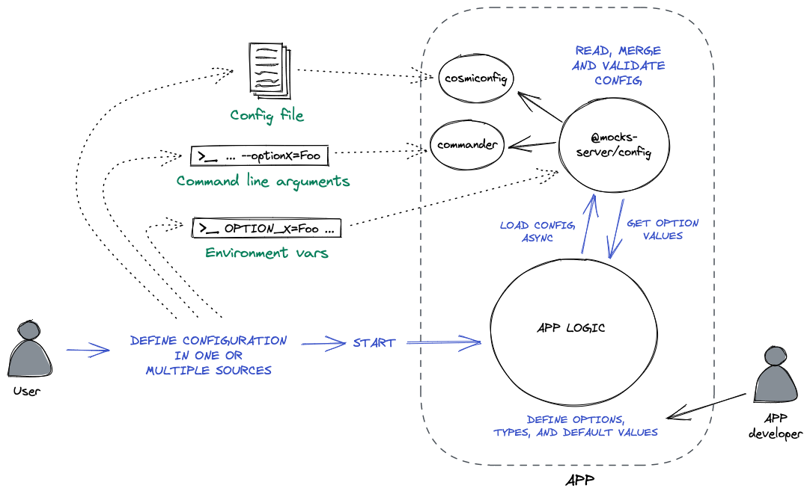
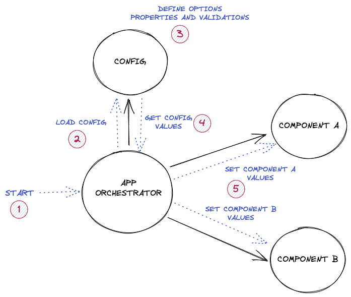
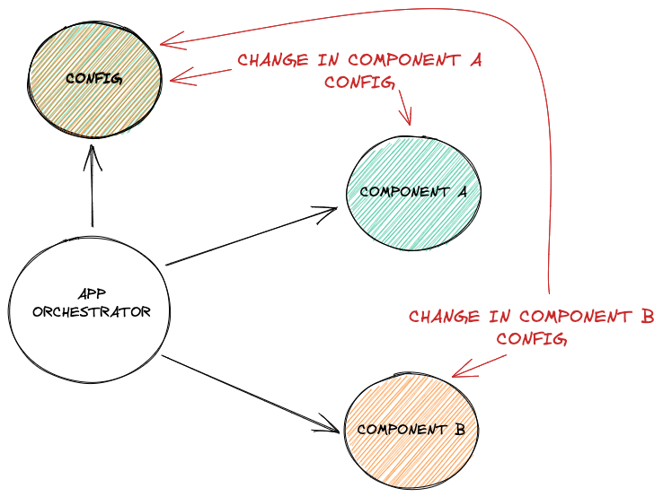
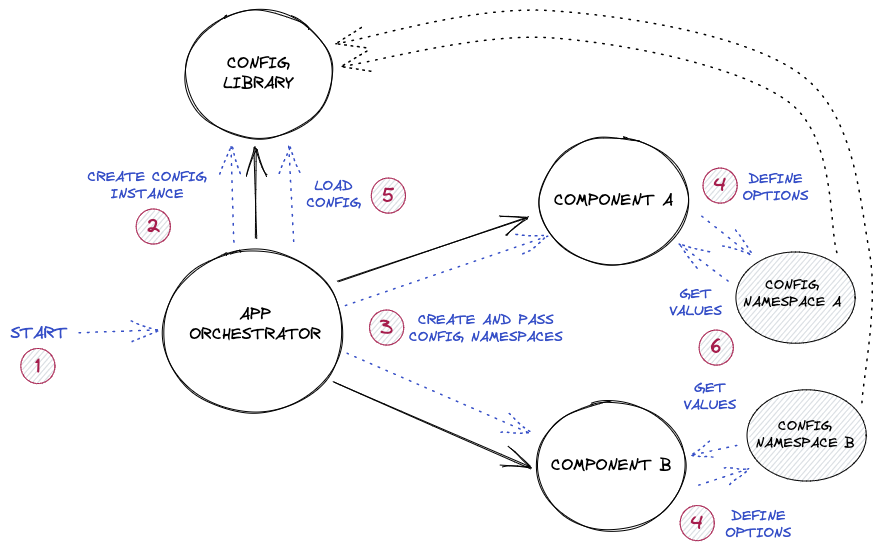

When creating a Node.js application, one usual task is to read configuration somehow in order to let the user define some settings for it. There are __lots of awesome configuration libraries at charge of making easy this task, but each one is specialized in reading config from one single source__, such as files, arguments or environment variables. I usually use these libraries to read configuration from arguments or configuration files:

* [__cosmiconfig__](https://github.com/davidtheclark/cosmiconfig) - Reads configuration from a file. It searches for many file types and file names, and even supports defining config in the `package.json` file. Very customizable, it's an awesome library very flexible both for the app developer and for the app user.
* [__commander__](https://github.com/tj/commander.js) - A great library that allows to read configuration from process arguments, among other things.

But I personally like to be even more flexible with the users, and let them choose the source to define the configuration, because each one may have different requirements that can make easier to define the configuration using one than the others. So, I used to __repeat the task of defining, reading and merging configuration of each different source__ in a lot of my projects. And that's why I have created the configuration library that I'm going to talk about in this post:

* [__@mocks-server/config__](https://github.com/mocks-server/main/tree/master/packages/config) - It allows to define configuration options, and it reads environment variables and uses  [__cosmiconfig__](https://github.com/davidtheclark/cosmiconfig) and [__commander__](https://github.com/tj/commander.js) under the hood to provide values to them.

> Note: The library was developed as a part of the [__@mocks-server__ project](https://www.mocks-server.org) ecosystem, but it is not coupled to it and it can be used anywhere else, because it is fully configurable.

As a summary, it __reads, merge and validates configuration__ from:

* Default option values
* Configuration received programmatically
* Configuration files (using [__cosmiconfig__](https://github.com/davidtheclark/cosmiconfig) internally)
* Environment variables
* Command line arguments (using [__commander__](https://github.com/tj/commander.js) internally)

It also provides:

* Parsing objects from command line arguments or environment vars
* Isolated configuration namespaces
* Objects to get/set options values internally at any moment
* Events when any option value changes



## Quick start

In this example we are going to create a simple option of type `string`, and we are going to see how to read its value:

Add the library `@mocks-server/config` to your package dependencies:

```sh
npm i --save @mocks-server/config
```

Import the library and create a configuration instance. You must provide a `moduleName` option. It will determine the name of the configuration files that will be searched for, and the prefix of the environment variables:

```js
import Config from "@mocks-server/config";

const config = new Config({ moduleName: "myApp" });
```

Now that we have created the `config` instance, we can start adding options to it. In this case, we are going to create an option named `myOption`, of type `string`, with a `fooValue` default value:

```js
const myOption = config.addOption({
  name: "myOption",
  type: "string",
  default: "fooValue",
});
```

Now, we only have to load the configuration. Note that it is an async process, so we have to wait for it to finish before reading the options values:

```js
config.load().then(() => {
  console.log(myOption.value);
});
```

At this point, supposing that our file was named `app.js`, we can define the value for our option simply defining an environment variable named `MY_APP_MY_OPTION` (Environment variables must be prefixed with the value of the `moduleName` option, and they must be defined using "screaming snake case"):

```sh
MY_APP_MY_OPTION=anotherValue node app.js
```

Or we can define it using a command line argument:

```sh
node app.js --myOption=anotherValue
```

We can also create a `.myApprc.json` file at the same folder, and simply run `node app.js`:

```json
{
  "myOption": "anotherValue"
}
```

Or a `myApp.config.js` file:

```js
module.exports = {
  myOption: "anotherValue"
};
```

Or even a `.myApprc.yml` file. You can check the [whole list of supported file formats at the `@mocks-server/config` docs](https://github.com/mocks-server/main/tree/master/packages/config).

```yaml
myOption: anotherValue
```

## Sources priority

When reading sources, the library will try to search for the value of each option in every source (unless it is explicitly configured for skipping some sources). So, the values for different options, or even for the same option, can be defined in different sources at a time. In that case, __it applies a priority to the sources__, which is, from lower to higher:

* Option default value
* Configuration file
* Environment variable
* Process argument

This is very useful, because __you can have a configuration file in your app with some values, but override some of them defining environment variables when you start the application__, or even using command line arguments, which will override even the values of environment variables.

## Option types

It does not only read values from different sources, but it also parses the values to each correspondent option type.

Options can be of one of next types: `boolean`, `number`, `string`, `object` or `array`. The `array` type also allows to define the type of items contained in it.

For example, if an option is of type `boolean` and it is defined in a environment variable, its value will be converted from `false`, `true`, `1` or `0` strings to a boolean type:

```
MY_APP_MY_BOOLEAN_OPTION=1 node app.js
# value -> true
```

If the option is of type `number`, it will be parsed to a numeric value:

```
node app.js --myNumberOption=2
# value -> 2 as a number
```

And it parses even options of type `object` from command line arguments and environment variables:

```
MY_APP_MY_OBJECT_OPTION='{"foo":"var"}'
# value -> {foo: "var"}
```


## Changing settings in runtime. Events

Apart from reading the configuration, __the library can also be used to modify options in runtime__. Suppose that your application provides an API for changing settings while it is running (which is the case of [Mocks Server](https://www.mocks-server.org), for example). If that is the case, you can modify the values of the options from the API component, and the other components can listen to changes in the options and act in consequence whenever it is needed, because the library also emits events whenever an option changes its value.

Use the `onChange` method to add event listeners to value changes:

```js
const myOption = config.addOption({
  name: "myOption",
  type: "string",
});

myOption.onChange((newValue) => {
  console.log(`myOption value has changed to ${newValue}!`);
});
```

Use the `value` setter to change the value of an option:

```js
myOption.value = "anotherValue";
// console -> myOption value has changed to anotherValue!
```

## Modularity: namespaces

For sure that you have noticed the word "modular" in the title of this post. But, for the moment, what makes this library to be "modular"? It seems to be a simple configuration provider reading values from some different sources. Well, here is where the "namespaces" concept enter.

But, first of all, __why should a configuration provider be modular__?

Well, we are going to suppose that __we have an app that is very well designed__. It has a very clean architecture in which __each internal component is responsible to do one single thing__ (that's what we all want in our applications, don't we?). And some of that components need some user configuration to do their job. Suppose also that __our configuration contains some logic about the options, such as validation, parsing, etc.__ In my experience, the configuration is usually something that is provided by a specific component in the application, and it is usually placed very next to the application higher levels. One of the first things that we usually do is reading the configuration in some place in our app, and then we pass that configuration to the other internal components (of course that this wouldn't be always the case, but I have seen it lots of times, and I usually did it also in the same way).



<div class="imageNote">"Global" configuration provider. It contains the logic for reading config for all components</div>

__If that is the case, then it may become a problem, because every time we need to modify or to add an option to any of the internal components, we must modify also our "global" configuration provider__. And, in an ideal world, we should modify only the involved component, am I right?



<div class="imageNote">Any change in the configuration of any component impacts in the "global" config component</div>

Using the [__`@mocks-server/config`__](https://github.com/mocks-server/main/tree/master/packages/config) library, you could avoid this problem simply passing the `config` instance to each component, and let them add their options. It is a good solution, but, depending on the scale of the project and the amount of options, it may result in conflicts between the names of the options from different components.

### Namespaces to the rescue

In order to avoid that problem, the [__`@mocks-server/config`__](https://github.com/mocks-server/main/tree/master/packages/config) library provides the "namespaces" concept, so each component can be the owner of its own configuration namespace, and it can modify its options whenever it is needed without the risk of conflicts with the other components.

Following with the previous example, we can use the `addNamespace` config method for creating a namespace. We must pass the name for the namespace as first argument:

```js
const myNamespace = config.addNamespace("myNamespace");
```

And now that we have our namespace created, we can add options to it as we did in the `config` instance in the previous example:

```js
myNamespace.addOption({
  name: "myOption",
  type: "string",
  default: "fooSecondValue",
});
```

Then, when defining environment variables, we must add the namespace name as a prefix to the option name:

```sh
MY_APP_MY_NAMESPACE_MY_OPTION=anotherValue node app.js
```

When using command line arguments, we must add the prefix separated by a dot:

```sh
node app.js --myNamespace.myOption=anotherValue
```

And when using configuration files, each namespace corresponds to an object key:

```json
{
  "myNamespace": {
    "myOption": "anotherValue"
  }
}
```

### Keeping components isolated

So, you can keep your components configuration isolated creating and passing a different namespace for each one of them. The next example shows a theoretical app creating different namespaces for some components:

```js
const dbConnector = new DBConnector({
  config: config.addNamespace("db"), 
});

const api = new Api({
  config: config.addNamespace("api"), 
});

await config.load();
await dbConnector.start();
await api.start();
```



<div class="imageNote">Each component contains the logic for defining, parsing and validating its own options</div>

### As complex or simple as you may need

Even when namespaces is a great feature, it may not be useful to you if your app only needs few configuration options, or if there is no risk of conflicts between the component options, or even if you want to keep the configuration as much simple as possible for the user. In that case, you could simply pass the `config` instance to each component and let them to add their own options to the root namespace.

Or maybe you need even a more complex structure for your configuration, because some of your components depends on many other internal components. In that case, nested namespaces are supported also:

```js
const myNestedNamespace = config.addNamespace("first")
  .addNamespace("second")
  .addNamespace("third")
  .addOption({
    name: "foo",
    type: "number",
  });
```

Which, for example, would result in a `yaml` configuration file like this:

```yaml
first:
  second:
    third:
      foo: 3
```

Or in an argument like this:

```sh
node app.js --first.second.third.foo=3
```

### Breaking the modularity rules

Even when the library was designed to provide modularity, it is flexible enough to allow breaking the rules whenever it is needed. For example, in a previous example I talked about an API changing the configuration. Supposing it is able to change the configuration of any component, then that API is breaking the modularity rules.

If this is needed, you can use some library methods to access to any namespace configuration options, or even provide a whole configuration object that will set every namespaces at a time. For example:

```js
config.set({
  first: {
    second: {
      third: {
        foo: "foo"
      }
    }
  }
});
```

This would set options for all provided namespaces in the object. It is not desirable to do things like this when we are talking about modular solutions, but it can be used if there is no other better alternative. You can [read the library API docs to know more about config available methods](https://github.com/mocks-server/main/tree/master/packages/config#api).

## Further information

This post tried to be only an introduction to the main features of the library, so there are many other interesting things that were not mentioned here, like:

* Configuring the library itself. Deactivating sources, using custom file names, etc.
* How to define values for each different option type on each different source
* Library lifecycle. Handling complex use cases

For further information, [you can read the whole technical docs of the library here](https://github.com/mocks-server/main/tree/master/packages/config).