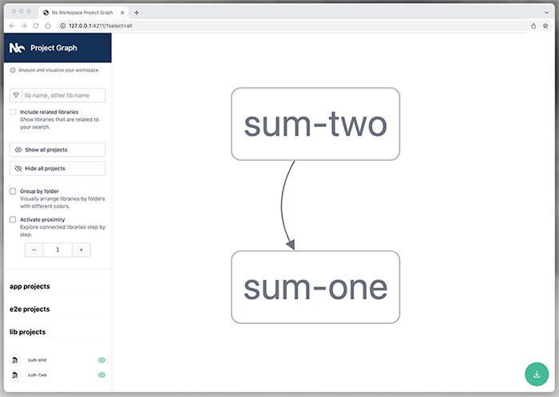
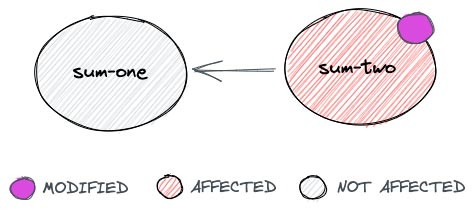
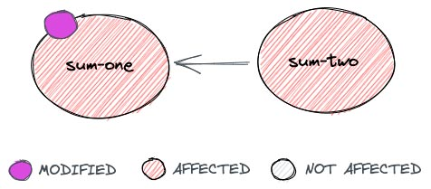
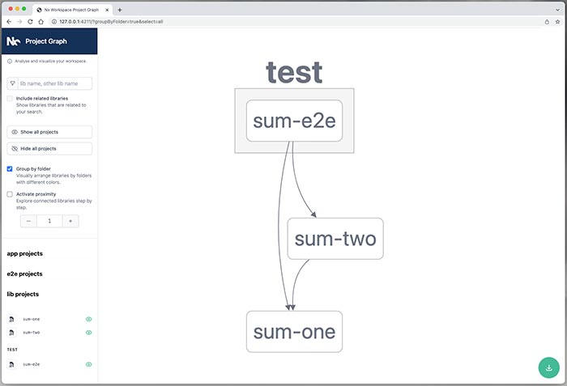
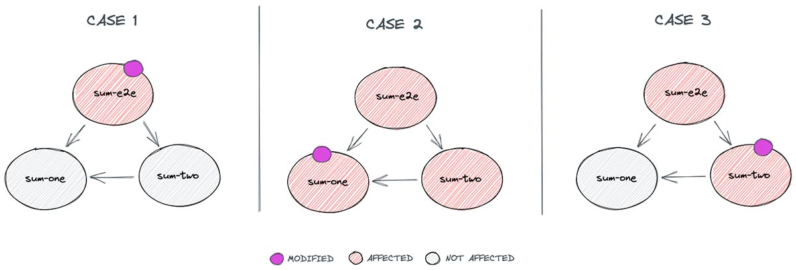

<div class="photoAuthor">Photo by Kawser Hamid</div>

## Preface

In the [previous chapter of this series of posts](/blog/pnpm-nx-monorepo-01), we analyzed the __reasons for using a monorepo to maintain many Node.js dependent packages__, and the requirements to have a __good development and continuous integration workflow__. In this post we are going to see how to build a monorepo using [Pnpm](https://pnpm.io/) and [Nx](https://nx.dev/), that, used together, will cover all the described requirements.

We are going to create a repository containing two simple projects that theoretically would be published to NPM, and a project containing E2E tests of both packages integrated. This is a step-by-step tutorial, but if you want to have all the code available, all of the examples are in [this Github repository](https://github.com/javierbrea/pnpm-nx-monorepo-example).

## Repository structure

In this tutorial, we will store the packages being published to NPM into a `packages` folder, and E2E tests into a `test` folder. The repository will contain also a `package.json` file in the root folder.

```txt
├── packages/
├── test/
├── .gitignore
└── package.json
```

> The name of the folders is something that can be changed at your convenience. You could store your packages depending of their type in different folders, for example. `Nx` recommends as best practices to have an `app` folder and a `libs` folder for reusable libraries, but in my opinion that structure is more recommendable if you are going to include also front-end projects or other type of not versioned and distributable applications. In this case, all packages could be distributable and dependencies of other ones, that's why the folder is named `packages`. I also like to keep integration or E2E tests in a different folder.

## Installing Pnpm

As seen in the [previous post](/blog/pnpm-nx-monorepo-01/), we are going to use [Pnpm](https://pnpm.io) mainly to be able to __link packages locally__ using its [workspace feature](https://pnpm.io/workspaces).

First of all you have to install `Pnpm` globally in order to use it as Npm client and to run the `package.json` scripts that we will create in next steps. There are many methods for installing it, you can check them all in the [Pnpm installation docs](https://pnpm.io/installation). Here we are going to use `npm` to install it:

```shell
npm install -g pnpm@next-7
```

Now we can fill the `package.json` file with some basic info, and we can use `Pnpm` to install the dependencies.

```json
{
  "private": true,
  "description": "Pnpm and Nx monorepo example",
  "scripts": {
    "prepare": "echo \"installed!\""
  }
}
```

```shell
pnpm i
```

# Configuring Pnpm

Now that we have installed `Pnpm`, we have to configure it so it can know which is the root of the workspace, and where are the packages. Create a `pnpm-workspace.yaml` file in the root folder containing:

```yaml
packages:
  # all packages in subdirs of packages/ and test/
  - 'packages/**'
  - 'test/**'
```

You can read [Pnpm workspace docs](https://pnpm.io/pnpm-workspace_yaml) for further info about how to include/exclude subfolders.

## Creating a project

Let's create our first project in the `packages` folder. We will name it `sum-one`. It will contain its own `package.json` file, and an `index.js` file exporting a method which sums one to a given number:

```txt
├── packages/
│   └── sum-one/
│       ├── index.js
│       └── package.json
├── test/
├── .gitignore
├── package.json
└── pnpm-workspace.yaml
```

For the moment, the `packages/sum-one/package.json` file only has to contain the basic package information:

```json
{
  "name": "sum-one",
  "version": "1.0.0-alpha.1",
  "description": "Sums one to a given number"
}
```

And the `packages/sum-one/index.js` file exports a very simple method. We will import this package and use it from the other one afterwards in order to see how we can define dependencies between projects in the monorepo workspace.

```js
function sumOne(number) {
  return number + 1;
}

module.exports = sumOne;
```

## Project and workspace dependencies

Now we have two `package.json` files in the repository. The one in the root folder should contain shared `devDependencies` across many projects, such as test, build or lint libraries, etc. but note that the `dependencies` of each package (those required to work once they are published) must remain on their own `package.json` files. Otherwise, they will be missing when the packages are published.

Note that __the dependencies of all packages in the repository are installed when `pnpm i` is executed__ in the root folder. And we can also use executables of the dependencies installed in the workspace from the `npm` scripts of the packages! 🥳

## Project and workspace scripts

The __scripts of each project can be executed independently from each package folder, and we can also define scripts for the workspace__. So, let's add one unit test to our recently created package in order to see an example.

We will install [Jest](https://jestjs.io/) in the workspace (as mentioned above, it is a `devDependency`, so we don't have to install it on every single package):

```shell
pnpm add -wD jest
```

> The `-wD` in the example means "Install it in the workspace, as a `devDependency`" 

Now we can use the `jest` executable in the `packages/sum-one/package.json` file, so let's create one basic test in that package. Create a `packages/sum-one/index.spec.js` containing:

```js
const sumOne = require("./index");

describe("sumOne", () => {
  it("should sum one to the given number", () => {
    expect(sumOne(2)).toEqual(3);
  });
});
```

And then add the script for running the test:

```json
{
  "name": "sum-one",
  "version": "1.0.0-alpha.1",
  "description": "Sums one to a given number",
  "scripts": {
    "test:unit": "jest"
  }
}
```

Now, you can run the package unit tests script from the package folder:

```shell
cd packages/sum-one && pnpm test:unit
```

But we don't want to be moving from one folder to another to run our development scripts, right? Be patient, in the next steps __we will add workspace scripts to run any script from any package in the workspace from the root folder__. 😉

## Creating a dependent project

Now we are going to add another project in order to see how we can define dependencies between them, so __we don't have to publish one package to be able to use it from another one__. For that, we will use the [Pnpm Workspace feature](https://pnpm.io/workspaces), that allows to reference workspace packages through aliases. __When packages are published, it automatically changes the references__ to the real versions or `semver` ranges, so we don't have to care about that.

We will name `sum-two` to our new package, and it will depend on `sum-one`:

```txt
├── packages/
│   ├── sum-one/
│   │   ├── index.js
│   │   ├── index.spec.js
│   │   └── package.json
│   └── sum-two/
│       ├── index.js
│       ├── index.spec.js
│       └── package.json
├── test/
├── .gitignore
├── package.json
└── pnpm-workspace.yaml
```

Here is the content of the `packages/sum-two/package.json` file. __Note the usage of `workspace:*` for creating a local reference from one package to another__, that will be replaced by the real version of the other package (1.0.0-alpha.1) when this one is published.

```json
{
  "name": "sum-two",
  "version": "1.0.0-beta.1",
  "description": "Sums two to a given number",
  "scripts": {
    "test:unit": "jest"
  },
  "dependencies": {
    "sum-one": "workspace:*"
  }
}
```

Now we can add the content of the `packages/sum-two/index.js` file, which will require the `sum-one` package:

```js
const sumOne = require("sum-one");

function sumTwo(number) {
  return sumOne(sumOne(number));
}

module.exports = sumTwo;
```

And we are ready also to add the unit test of this package to the `packages/sum-two/index.spec.js` file:

```js
const sumTwo = require("./index");

describe("sumTwo", () => {
  it("should sum two to the given number", () => {
    expect(sumTwo(3)).toEqual(5);
  });
});
```

Now we have to reinstall the workspace dependencies, and then we can run the unit tests of the `sum-two` package, which proves that our local reference works properly:

```shell
pnpm i
cd packages/sum-two && pnpm test:unit
```

## Installing Nx

As a fast recap, at this point we have two dependent packages in the same repository, linked locally using the [Pnpm Workspace feature](https://pnpm.io/workspaces). Both packages have unit tests and they share the `jest` dependency, but we can run them only from each different package folder.

Now we are going to install Nx because it provides the other requirements that we saw in the [previous post](/blog/pnpm-nx-monorepo-01/):

* __Dependencies analysis__
* __Detection of affected projects__
* __Tasks orchestration__

`Nx` can also be installed globally, but I prefer to install it as a project dependency in order to define a specific version, so the same version is always used in all different local and remote environments. Afterwards we will expose some of the `Nx` commands that we need for our development workflow using our own `package.json` scripts.

Install as `devDependencies` the required `nx` packages and `typescript`, which is a peer dependency:

```shell
pnpm add -wD nx @nrwl/workspace typescript
```

## Configuring Nx

[Nx](https://nx.dev/) has a lot of configuration options, but for the moment we are going to see only the basic configuration that allows to execute any package script from the root workspace folder, see the dependencies graph, etc. In next posts of this series we'll see more advanced options.

Create a `nx.json` file in the root folder. It will contain some `Nx` basic configuration:

```json
{
  "extends": "@nrwl/workspace/presets/npm.json",
  "affected": {
    "defaultBase": "main"
  },
  "npmScope": "@my-scope",
  "tasksRunnerOptions": {
    "default": {
      "runner": "@nrwl/workspace/tasks-runners/default"
    }
  },
  "implicitDependencies": {
    "pnpm-workspace.yaml": "*",
    "pnpm-lock.yaml": "*",
    "package.json": {
      "dependencies": "*",
      "devDependencies": "*"
    },
    "nx.json": "*"
  }
}
```

## Using the Nx CLI

As we have not installed Nx globally, we need to define a script in our workspace `package.json` file to allow running its commands. For the moment we will only add a "shortcut" or "alias" to the `nx` command, but later we will add specific scripts for running usual development tasks. For simplicity of the examples, here we will show only the `scripts` property of the `package.json` file:

```json
{
  "scripts": {
    "nx": "nx"
  }
}
```

Now we can use `nx` to run any script of any project in the workspace from the root folder. For example, we can run the unit tests of `sum-one`:

```shell
pnpm nx test:unit sum-one
```

> Note that we use `pnpm nx` to run any `nx` command through our workspace `nx` installed dependency instead of having it installed globally. `nx` supports passing a npm script name as first argument and the package name as second argument: `pnpm nx [script] [project]`

So, for running the `unit:test` script of the `sum-two` package we can do:

```shell
pnpm nx test:unit sum-two
```

## Adding workspace scripts

Now we are able to run any package script from the root folder of our workspace using Nx. But __we can add more scripts for running usual tasks instead of using directly the `nx` interface__. For example, let's add one script for running all unit tests of all packages in the workspace. (As we will see later, in reality, this script shouldn't be used very usual, because we should run only the unit tests of the affected packages, but it is added only to illustrate how to add custom scripts for making our workflow easier).

```json
{
  "scripts": {
    "nx": "nx",
    "test:unit:all": "nx run-many --target=test:unit --all"
  }
}
```

Now, we can run the unit tests of every package in our workspace with a single command, and it will be done in parallel! 🥳

```shell
pnpm test:unit:all
```

> You can learn [more about the `nx` interface in its API reference page](https://nx.dev/getting-started/intro). It provides lots of options for filtering projects, enabling/disabling parallel executions, etc.

## Dependencies graph

An awesome feature of [Nx](https://nx.dev/) is the ability of starting a web app drawing a graph with the dependencies between the projects in our workspace. Simply run:

```
pnpm nx graph
```

This will open automatically a browser tab with the Nx dependencies graph:



## Affected projects

In a previous step, we added a script to run all unit tests of all packages in the workspace just to show how to add useful alias scripts to our workspace. But this is something that we normally wouldn't want to do. We usually want to run just the unit tests of the packages that have been modified, and also the unit tests of the packages that are dependent on them, and the affected integration or E2E tests.

Here is where the Nx `affected` command enters. Using it, we can compare our repository branch with the desired base branch in order to know which projects have been modified, and then calculate the affected ones, and run any script from all of them.

Let's add one script to the root `package.json` file in order to provide an easy alias for doing it:

```json
{
  "scripts": {
    "nx": "nx",
    "test:unit:all": "nx run-many --target=test:unit --all",
    "test:unit:affected": "nx affected --target=test:unit"
  }
}
```

Note that this script has to be executed in a Git repository to be able to compare changes. The default base branch to compare with is defined in the `nx.json` file that we created previously, which in this case is `main`. So, supposing that you have a repository and you have all previous changes promoted to the `main` branch, if you modify the `packages/sum-two/index.js` file, running the next command would execute only the unit tests of the `sum-two` package, because no other package depends on it.

```shell
pnpm test:unit:affected
```



But, if you create another branch and modify the `packages/sum-one/index.js` file, running `pnpm test:unit:affected` would execute the unit tests of both packages, because modifying `sum-one` also affects to `sum-two`.



## Dependent tasks

Now we can run the unit tests of the affected packages with a single command, but, what about if the `unit:test` script in any package needs any other script to be executed before? For example, suppose that the `sum-two` package has a `build` script that must be executed before running the unit tests. Should we execute it manually before running the affected command? If we have twenty packages in the workspace, some of them containing a `build` command, and some others not, then should we create a `build:affected` script and execute it always before running the unit tests? Well, we could, but __`Nx` provides a mechanism to define dependent tasks, so it detects whether any package have dependent tasks that should be executed before others__, and it executes them in that case.

Nx also provides a cache mechanism, so it won't execute a dependent task of a package that has not been modified since it was executed the last time, so you don't have to care about the performance of running every dependent tasks always. You can read about [how to configure it in the Nx docs](https://nx.dev/configuration/projectjson).

So, let's add a fake `build` script to the `packages/sum-two/package.json` file:

```json
{ 
  "scripts": {
    "build": "echo \"Built!\"",
    "test:unit": "jest"
  }
}
```

You can check that the new script works properly by running:

```shell
pnpm nx build sum-two
```

> If the command above does not work, try cleaning the `nx` cache running `pnpm nx reset`. Sometimes Nx needs a "little push" when adding scripts or modifying configurations.

Now that we have a `build` command that theoretically should be executed before running the unit tests, let's let Nx know about that dependency. We must edit the `nx.json` file, adding the `targetDependencies` property as in the next example:

```json
{
  "targetDependencies": {
    "build": [
      {
        "target": "build",
        "projects": "dependencies"
      }
    ],
    "test:unit": [
      {
        "target": "build",
        "projects": "self"
      }
    ]
  }
}
```

With this configuration, we are saying to Nx: _"Before running the `test:unit` script of any package, run the `build` script of the package itself, and before running the `build` script of any package, run the `build` script of its dependencies."_. So, in our case, when we run:

```shell
pnpm nx test:unit sum-two
```

It will run first the `build` script of the `sum-two` package, and then the `test:unit` one. If there was a `build` script in the `sum-one` package, it would execute it as well, because it is a dependency of the `sum-two` one.

## Adding integration or E2E tests

In order to have a full example before going to the next chapter, in which we will create a continuous integration pipeline using a Github action, we are going to add also a project containing E2E tests. In our case, the unit tests of the `sum-two` package should be enough, because unit tests are not mocking the dependency with `sum-one`. But note that the code of the projects here is not really relevant.

```txt
├── packages/
│   ├── sum-one/
│   │   ├── index.js
│   │   ├── index.spec.js
│   │   └── package.json
│   └── sum-two/
│       ├── index.js
│       ├── index.spec.js
│       └── package.json
├── test/
│   └── sum-e2e/
│       ├── index.spec.js
│       └── package.json
├── nx.json
├── package.json
└── pnpm-workspace.yaml
```

Here is the code of the `test/workspace-e2e/package.json` file. We will use the `sum-two` and `sum-one` packages to execute the test, so we define the dependencies, and note that we have also added a script named `test:e2e`. This is useful to differentiate the type of test that we want to execute, so we can run affected E2E tests and unit tests in a different stage of the pipeline, for example.

```json
{
  "name": "sum-e2e",
  "private": "true",
  "description": "E2E tests of all sum packages",
  "scripts": {
    "test:e2e": "jest"
  },
  "dependencies": {
    "sum-one": "workspace:*",
    "sum-two": "workspace:*"
  }
}
```

Let's write the code of the test. We are going to use also the `sum-one` package just to add another dependency. It may have no sense in a real project, but it is useful for this example:

```js
const sumTwo = require("sum-two");
const sumOne = require("sum-one");

describe("When using sumOne and sumTwo", () => {
  it("should sum three to the given number", () => {
    expect(sumOne(sumTwo(4))).toEqual(7);
  });
});
```

Let's add also a new task dependency, so before running E2E tests it will also run the `build` script of all dependent projects. Modify the `targetDependencies` property in the `nx.json` file as in:

```json
{
  "targetDependencies": {
    "build": [
      {
        "target": "build",
        "projects": "dependencies"
      }
    ],
    "test:unit": [
      {
        "target": "build",
        "projects": "self"
      }
    ],
    "test:e2e": [
      {
        "target": "build",
        "projects": "dependencies"
      }
    ]
  }
}
```

Now, we are ready to install the dependencies of the new project, reset the nx cache (this is recommended when adding a new project) and run the E2E tests:

```shell
pnpm i
pnpm nx reset
pnpm nx test:e2e sum-e2e
```

We can also run the Nx `graph` command to see how our dependencies graph has changed after adding this new project:

```shell
pnpm nx graph
```



> You may have noticed that Nx does not recognize the `sum-e2e` project as of `e2e` type. For allowing Nx to recognize it, we should add a `project.json` file to the project defining its type as "application", but this produces Nx not detecting the dependencies automatically in our simple example if we don't add more configuration such as TypeScript aliases. So, I have omitted that extra configuration in order to keep the examples of this post as simple as possible.

## Incremental testing

Based on the previous dependencies graph, and in the mentioned "affected" Nx feature, note this: If we execute `pnpm nx affected --target=test:e2e`, our E2E tests project would be always executed because it is always affected by any modification, but the unit tests of each project (`pnpm nx affected --target=test:unit`) would be executed only when it has sense depending on the modification made.

> NOTE: If you are using a Pnpm version lower than 7.0, you should add an extra `--` to the Pnpm commands before the Nx arguments: `pnpm nx affected -- --target=test:unit`



## Conclusion

In this post we have seen how to create a monorepo using [Pnpm](https://pnpm.io/) and [Nx](https://nx.dev/). Let's see the __list of requirements__ that we set in in the [previous chapter of this series of posts](/blog/pnpm-nx-monorepo-01/) in order to check whether it meets all of them or not:

* __Configuration for linking dependencies locally__ - ✅  _It host many packages linked locally. The local references between packages are changed automatically to pinned versions when they are published._
* __Dependencies analysis__ - ✅ _It is able to detect dependencies between projects, and even provides a graph._
* __Detecting affected packages/projects__ - ✅ _It determines which projects might be affected by a change._
* __Task orchestration__ - ✅ _It is able to run dependent tasks in the correct order with some minimal configuration._

Effectively, our monorepo __meets all of the requirements that we defined in the previous chapter, with minimal configuration__. The configuration could be improved in order to let Nx know the type of each project for adding more features like architecture boundaries using `eslint`, etc., but this, among other lot of things that obviously can be improved, is out of the scope of this post.

In the next chapter, __we will use this example to create a continuous integration workflow for the monorepo using a Github action__.

> Note: The examples of this post are available at [this Github repository](https://github.com/javierbrea/pnpm-nx-monorepo-example).

## Other post in this series

- [Why a monorepo? Requirements for a good workflow](/blog/pnpm-nx-monorepo-01/)
- [Building a Node.js monorepo using Pnpm and Nx](#)
- [CI/CD for Pnpm and Nx monorepo using Github actions](/blog/pnpm-nx-monorepo-03/)
