<div class="photoAuthor">Photo by cottonbro in Pexels</div>

## Preface

In the previous chapters of this series of posts, we saw the [__reasons for using a monorepo to maintain many Node.js dependent packages__, and the requirements to have a __good development and continuous integration workflow__](/blog/pnpm-nx-monorepo-01). Then we saw [__how to build a Pnpm and Nx monorepo__](/blog/pnpm-nx-monorepo-02).

Now we are going to see __how to create a continous integration workflow for the Nx and Pnpm monorepo using Github actions__.

We are going to use the [repository created in the previous post](https://github.com/javierbrea/pnpm-nx-monorepo-example) for the examples of this one. This is a step-by-step guide, but you can directly check the repository code while reading for a faster approach.

## Workflow requirements

First of all, let's see what we want to build.

As a quick recap, in the previous post we finished with a monorepo containing two Node.js packages and one E2E testing project. This is what we are going to use for checking the pipelines that we are going to build, but our continuous integration workflow should be valid for any quantity of projects built with Node.js and E2E testing projects.

The workflow will consist of four basic tasks: __Build, unit testing, E2E testing, and deployment__. Adding more tasks, such as linting the code, running integration test, etc., could be also added easily, but we will create only these ones for keeping the examples as simple as possible.

Let's make a list with all of the requirements:

* __Scalable__ - It must be possible to add more projects without changing the workflow. Adding new tasks should be done easily too.
* __Incremental__ - It must build, test and deploy only the affected packages.
* __Fast__ - It must run tasks in parallel.
* __Multi version__ - It must run tests using different Node.js versions in order to check backward compatibility.
* __Multi platform__ - It must run tests on Windows and Linux operating systems.
* __Automatic__ - Obviously, the pipelines must be triggered automatically when some actions are performed in the code repository, such as opening a PR or tagging a specific branch.
* __Blocker__ - It must run every needed verification before allowing to promote code. It must block code promotion when any check fails.

Note that some of these are specific requirements for projects containing Node.js packages, such as the multi version testing. This is something that we wouldn't need when talking about front-end projects, for example. This article is focused on Node.js packages, but most of the contents __could be valid also for other type of projects with minimal changes.__

## Branching model

Our branching model will consist only on two long-living branches: `main` and `release`. In this model we would create a feature branch which is short lived and merged often to release. The code would remain in the release branch until the main project maintainer considers that it is ready for declaring a formal release (ideally often too). At that moment, a PR would be opened to `main`, and once it passed the checks and it is merged, a new release would be created by tagging the `main` branch.

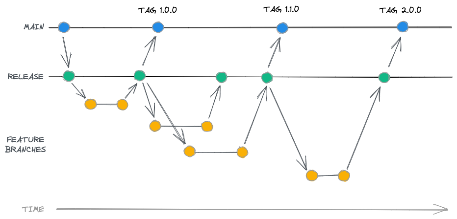

## The workflow

Now that we have defined our branching model and we know how the code is going to be promoted, let's see which tasks should the workflow run on each "event" of that model.

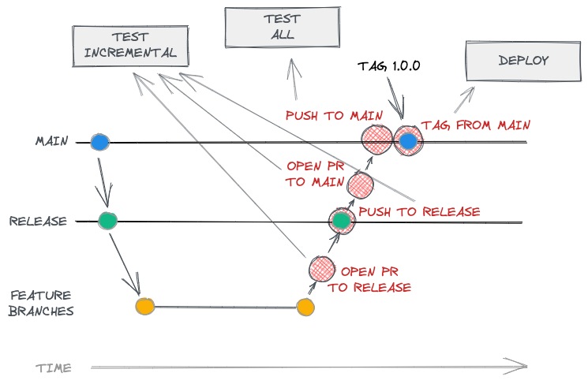

As we can see in the schema, there are two different pipelines that we should create for our workflow. One for testing and another one for the deployment. The testing pipeline will be able to run incremental testing or to test all depending on the event that triggered it:

* __Incremental testing__ - Only testing of affected projects is executed. It is triggered whenever a PR is opened to the `main` or `release` branches, or when code is pushed to the `release` branch. We could also run it on every push to any branch, or only a part of it, but for simplicity of the examples we are going to run it only in these cases.
* __Test all__ - When code is pushed to the `main` branch, then we execute tests on all projects. This is made in order to add extra verifications, and to be able to know the build status of the branch (in our branching model we don’t have a branch to compare with the main branch. We could compare to the latest tag, but this is something we are not going to see in this post)
* __Deploy__ - Triggered every time a new release is created in Github.

## Creating the first pipeline

So, now that we have the requirements and the design of the workflow, we can create the first pipeline. It will build and test only the affected projects whenever a PR is opened or the code is pushed to `release` or `main` branches.

To create the first Github action, add a file named `.github/workflows/build.yml`:

```txt
├── .github/
│   └── workflows/
│       └── build.yml
├── ...
```


For the moment we will add to it the configuration defining the events that will trigger it:

```yaml
name: build
# Events configuration
on:
  # Execute it on pushing to next branches
  push:
    branches: 
      - main
      - release
  # Execute it on opening any pull request
  pull_request:
```

## Information about the branches

We will need to know which is the base branch in many steps of our workflow in order to configure Nx properly and to be able to calculate the affected projects, for example. So, we will add a first job, getting the information and exporting it as a Github Action `output`. We will use it afterwards in other jobs. Note that, depending whether the workflow is triggered by a pull request or not, we will get the information using different Github actions variables.

```yaml
# ...events configuration
jobs:
  # Get branch info
  branch-info:
    runs-on: ubuntu-latest
    steps:
      # Get current branch name
      - name: Get branch name
        id: branch-name
        uses: tj-actions/branch-names@v5.2
      # Get base branch name to compare with. Base branch on a PR, "main" branch on pushing.
      - name: Get base branch name
        id: get-base-branch-name
        run: |
            if [[ "${{github.event.pull_request.base.ref}}" != "" ]]; then
              echo "::set-output name=branch::${{github.event.pull_request.base.ref}}"
            else
              echo "::set-output name=branch::main"
            fi
    outputs:
      # Export the branch names as output to be able to use it in other jobs
      base-branch-name: ${{ steps.get-base-branch-name.outputs.branch }}
      branch-name: ${{ steps.branch-name.outputs.current_branch }}
```

Now every time we open a PR or push to `main` or `release` branches the workflow will be executed. As a tip, you can add your own branch name to the list of branches in the workflow for testing it without opening a PR.

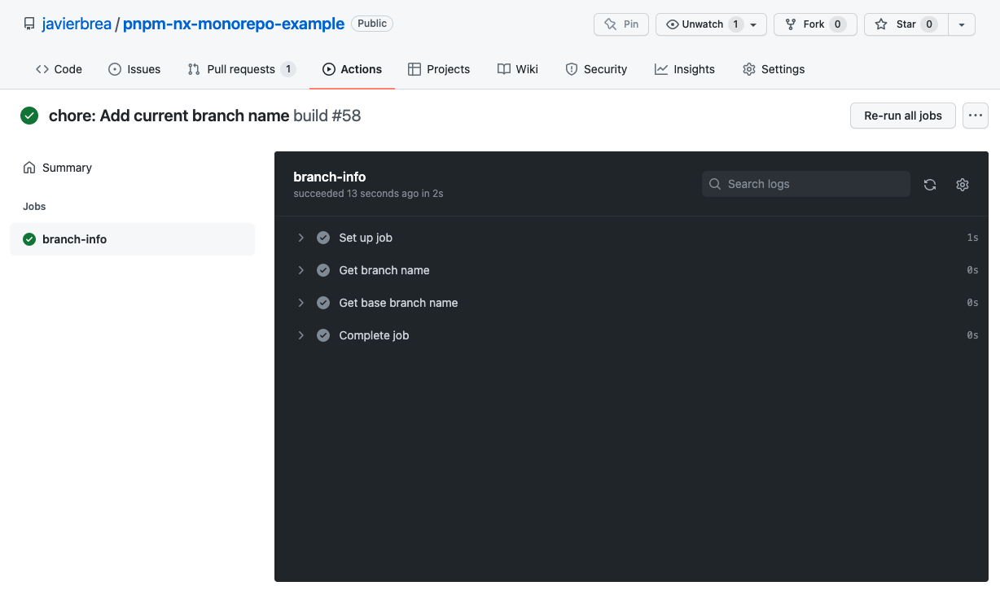

## Affected projects

The first thing that we are going to do in the pipeline is to get the affected projects. But, if Nx is able by itself to calculate the affected projects and run the desired tasks only on them, __why do we want to know which are?__ Well, we need to know the affected projects because __we are going to create one different job in the workflow for each different task to be executed in an affected project__. Even when Nx is able to run tasks in parallel, all of them would be executed in the same step, so it could end in performance issues depending on the heavy that our tasks are. That's why __we are going to use Github matrixes and jobs to distribute the tasks__. This way we can configure the number of max parallel tasks to be executed also in the workflow configuration, and, depending on the number of projects, and the heavy the tasks are, __we can adjust the parameters to get the workflow finished as fast as possible__.

Let's add the first job steps. Note that here we are configuring `Nx` using the output from the previous job, so we have to declare the dependency using the `needs` property:

```yaml
# ...events configuration
jobs:
  # ...previous jobs
  get-affected:
    needs: [branch-info]
    runs-on: ubuntu-latest
    steps:
      # Check out the repository
      - uses: actions/checkout@v3
        with:
          fetch-depth: 0
      # Configure Nx to be able to detect changes between branches when we are in a PR
      - name: Derive appropriate SHAs for base and head for `nx affected` commands
        uses: nrwl/nx-set-shas@v2
        with:
          main-branch-name: ${{needs.branch-info.outputs.base-branch-name}}
      # Install Pnpm
      - name: Install pnpm
        uses: pnpm/action-setup@v2.2.1
        with:
          version: "7.x"
      # Install Node.js
      - name: Use Node.js
        uses: actions/setup-node@v3
        with:
          node-version: "16.x"
          cache: 'pnpm'
      # Install workspace dependencies
      - name: Install dependencies
        run: pnpm install

```

Nx provides a [command for listing the affected projects](https://nx.dev/cli/print-affected). We will use it to get the __list of projects in which each specific task should be executed__. But in order to create dynamic steps in the Github workflow, it would be better if we get the list as a stringified array, because this way we can use the [Github action's `fromJson` expression](https://docs.github.com/es/enterprise-cloud@latest/actions/learn-github-actions/expressions).

So, __the things that we have to do to get the list of tasks to be executed for each affected project in an optimal format is__:

* Call Nx command to get the list of affected projects for each specific task. For example: `pnpm nx print-affected --target=[task] --base [base branch] --select=tasks.target.project`.
* When we want to test all projects, passing as modified the `package.json` file will do the trick. Modifying that file affects all projects in the workspace. For example: `pnpm nx print-affected --target=[task] --files package.json --select=tasks.target.project`. 
* Get the output, clean the traces from it, and convert it from something like `sum-one, sum-two` into something like `["sum-one", "sum-two"]`.

> NOTE: If you are using a Pnpm version lower than 7.0, you should add an extra `--` to the Pnpm commands before the Nx arguments: `pnpm nx print-affected -- --target=[task] --files package.json --select=tasks.target.project`

This can be achieved using a bash script in the workflow itself, or using any other type of script at your convenience, so for brevity I will omit the code in this post. I have created a `scripts/print-affected-array.js` script in the sample repository that gets the needed output, and that's what we are going to call from the pipeline, passing two arguments to it: the task to be executed and the base branch. If you want to use my script to get the affected projects, follow the next steps:

* Install the `cross-spawn` development dependency:

```shell
pnpm add -wD cross-spawn
```

* Copy [this file](https://github.com/javierbrea/pnpm-nx-monorepo-example/tree/main/scripts/print-affected-array.js) into `scripts/print-affected-array.js`.
* Add the next step to the `get-affected` job:

```yaml
# ...events configuration
jobs:
  # ...previous jobs
  get-affected:
    steps:
      # ...previous get-affected steps
      - name: Get affected
        id: get-projects-arrays
        # When not in a PR and the current branch is main, pass --all flag. Otherwise pass the base branch
        run: |
            if [[ "${{github.event.pull_request.base.ref}}" == "" && "${{needs.branch-info.outputs.branch-name}}" == "main" ]]; then
              echo "::set-output name=test-unit::$(node scripts/print-affected-array.js test:unit --all)"
              echo "::set-output name=test-e2e::$(node scripts/print-affected-array.js test:e2e --all)"
            else
              echo "::set-output name=test-unit::$(node scripts/print-affected-array.js test:unit origin/${{needs.branch-info.outputs.base-branch-name}})"
              echo "::set-output name=test-e2e::$(node scripts/print-affected-array.js test:e2e origin/${{needs.branch-info.outputs.base-branch-name}})"
            fi
    outputs:
      test-unit: ${{ steps.get-projects-arrays.outputs.test-unit }}
      test-e2e: ${{ steps.get-projects-arrays.outputs.test-e2e }}
```

Note that we call to the script twice, one time for the `test:unit` task and another one for the `test:e2e` task. In the next steps we will use the two different outputs for creating different matrixes.

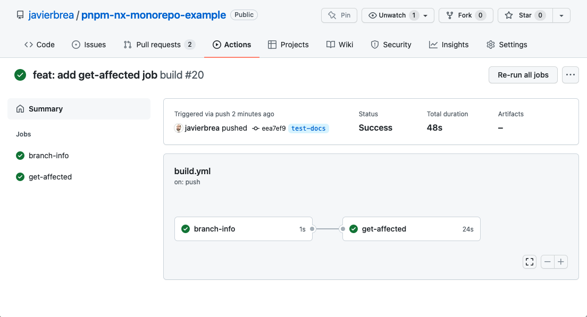

## Unit testing

At this point, __we have a workflow that is able to detect which tasks should we execute depending on the affected projects__. We have that information available in different Github Actions outputs, so __we can create jobs dynamically in order to run each different task in parallel__.

So, now we are going to use that information to run the unit tests of the affected projects in different jobs in parallel. Let's add the `test-unit` job:

```yaml
# ...events configuration
jobs:
  # ...previous jobs
  test-unit:
    runs-on: ubuntu-latest
    needs: [get-affected]
    # Skip the job if there are not affected projects containing unit tests
    if:  ${{ fromJson(needs.get-affected.outputs.test-unit)[0] }}
    strategy:
      # Run in parallel
      max-parallel: 4
      # One job for each different project and node version
      matrix:
        node: ["16.14.2"]
        projectName: ${{fromJson(needs.get-affected.outputs.test-unit)}}
    env:
      NODE: ${{ matrix.node }}
    steps:
      # Checkout and setup environment
      - name: Checkout
        uses: actions/checkout@v3
      - name: Install pnpm
        uses: pnpm/action-setup@v2.2.1
        with:
          version: "7.x"
      - name: Use Node.js
        uses: actions/setup-node@v3
        with:
          node-version: ${{ matrix.node }}
          cache: 'pnpm'
      - name: Install dependencies
        run: pnpm install
      # Run test:unit script in the affected project
      - name: Test unit
        run: pnpm nx test:unit ${{ matrix.projectName }}
```

Here is a screenshot showing how the `test-unit` matrix contains one different job for each project containing the `test:unit` script (supposing that both projects are affected):

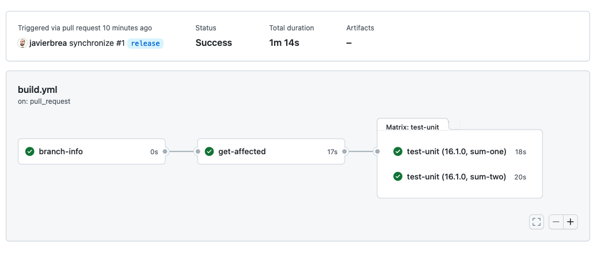

## Coverage

I have not configured in the example any tool to collect the project's unit testing coverage, this is something that I will explain in another post. Currently there are tools that support incremental coverage analysis with easy configuration, such as [Codecov](https://about.codecov.io/).

## Multi version

As we are already creating our unit testing jobs from a dynamic matrix, so now it is easy to add more Node.js versions to it. Modify the next line in the workflow, adding all currently active Node.js versions:

```yaml
      # One job for each different project and node version
      matrix:
        node: ["14.19.0", "16.14.2", "17.2.0", "18.0.0"]
```

As we can see in the next screenshot, now eight jobs are created, one for each different combination of project and Node.js version:

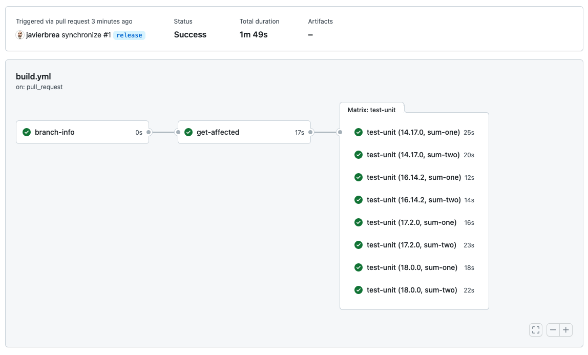

## E2E testing

Now we can add another jobs matrix for running the E2E tests. It is very similar to the one running the unit tests, but now we are going to execute it using only the two latest Node.js versions:

```yaml
# ...events configuration
jobs:
  # ...previous jobs
  test-e2e:
    runs-on: ubuntu-latest
    needs: [get-affected]
    # Skip the job if there are not affected projects containing unit tests
    if:  ${{ fromJson(needs.get-affected.outputs.test-e2e)[0] }}
    strategy:
      # Run in parallel
      max-parallel: 4
      # One job for each different project and node version
      matrix:
        node: ["17.2.0", "18.0.0"]
        projectName: ${{fromJson(needs.get-affected.outputs.test-e2e)}}
    env:
      NODE: ${{ matrix.node }}
    steps:
      # Checkout and setup environment
      - name: Checkout
        uses: actions/checkout@v3
      - name: Install pnpm
        uses: pnpm/action-setup@v2.2.1
        with:
          version: "7.x"
      - name: Use Node.js
        uses: actions/setup-node@v3
        with:
          node-version: ${{ matrix.node }}
          cache: 'pnpm'
      - name: Install dependencies
        run: pnpm install
      # Run test:e2e script in the affected project
      - name: Test E2E
        run: pnpm nx test:e2e ${{ matrix.projectName }}
```

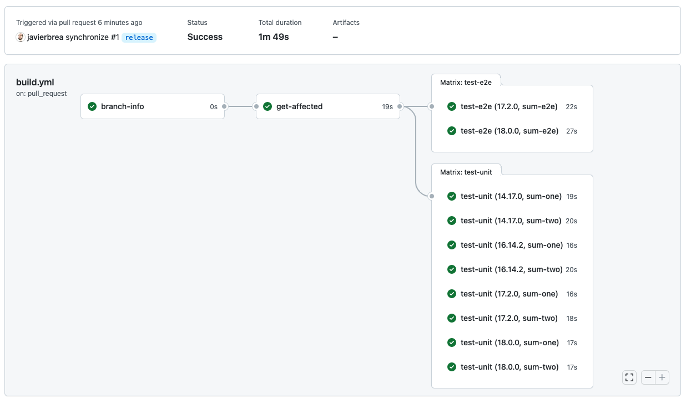

## Multi platform

At this point, the workflow is almost ready. It is calculating the affected projects and it is creating two matrixes of jobs for the affected projects, one for the unit testing and another one for E2E testing. Both of them are executed using multiple Node.js versions.

But remember that we defined as a requirement that the tests should be executed on different platforms also. So, let's add another matrix for running the E2E tests on Windows OS:

```yaml
# ...events configuration
jobs:
  # ...previous jobs
  test-e2e-windows:
    runs-on: windows-2019
    needs: [get-affected]
    if: ${{ fromJson(needs.get-affected.outputs.test-e2e)[0] }}
    strategy:
      max-parallel: 2
      matrix:
        node: ["17.2.0", "18.0.0"]
        projectName: ${{fromJson(needs.get-affected.outputs.test-e2e)}}
    steps:
      - name: Checkout
        uses: actions/checkout@v3
      - name: Install pnpm
        uses: pnpm/action-setup@v2.2.1
        with:
          version: "7.x"
      - name: Use Node.js
        uses: actions/setup-node@v2
        with:
          node-version: ${{ matrix.node }}
          cache: 'pnpm'
      - name: Install dependencies
        run: pnpm install
        env:
          HUSKY_SKIP_INSTALL: 1
      - name: Test E2E
        run: pnpm nx test:e2e ${{ matrix.projectName }}
```

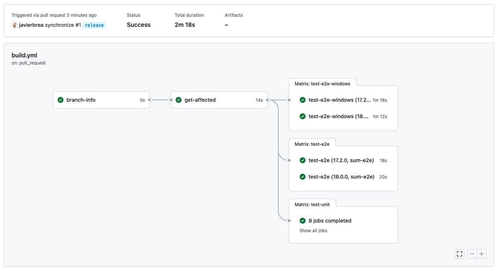

## Configuring Github checks

Now we should check that every job is finished properly before allowing to merge any pull request. For doing that, we are going to use the Github repository settings. We can add __branch protection rules in order to require status checks to pass before merging__. But __the problem is that we don't know which status checks will be executed on each different pull request__, because not every job will be executed always. Remember that __we are creating jobs only for the affected projects__.

The solution is to create a last job that will be executed whenever all of the others have finished. It will ignore the skipped matrixes, because sometimes no `unit-test` matrix will be created, or no `test-e2e` will be executed, etc. It will depend on the affected projects.

```yaml
# ...events configuration
jobs:
  # ...previous jobs
  build-finished:
    runs-on: ubuntu-latest
    needs: [test-unit, test-e2e, test-e2e-windows]
    if: |
      always() &&
      (needs.test-unit.result == 'success' || needs.test-unit.result == 'skipped') &&
      (needs.test-e2e.result == 'success' || needs.test-e2e.result == 'skipped') &&
      (needs.test-e2e-windows.result == 'success' || needs.test-e2e-windows.result == 'skipped')
    steps:
      - name: Trace
        run: echo "All jobs finished"
```

This is the job that we are going to use to require the status check in order to let all of the other jobs finishing before allowing to merge the pull request.

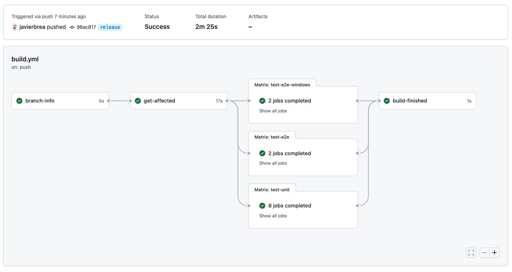

Go to the Settings tab of the repository. Then select `Branches` -> `Add rule`. Check the `Require status checks to pass before merging` option and add a new status check for the `build-finished` job:

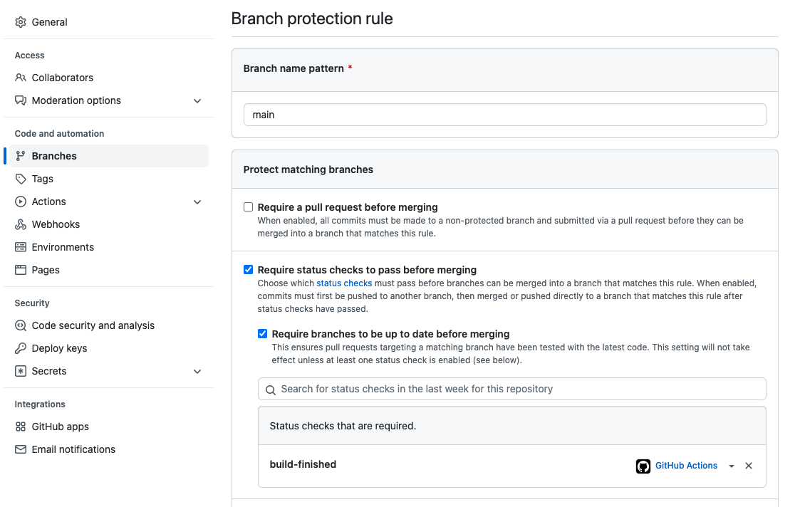

Now, every time a pull request is created it will require the `build-finished` job to be finished before allowing to merge it. As this job is waiting for all other dynamic jobs to have finished, if any of them fails, then the pull request will be blocked.

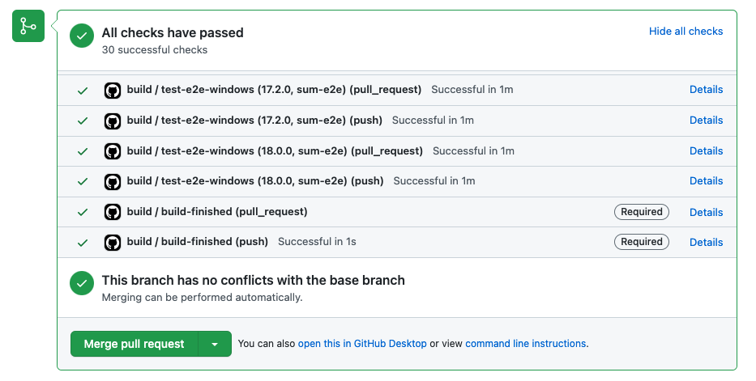

## Creating the second pipeline. Deploy

At this point, we are checking that every test of all affected projects is passing before allowing to merge a pull request, and we are running all tests in the `main` branch as an extra check. But there is still something important to do: We should __automatically publish the modified packages whenever a release is created.__

For this, we are going to create another workflow file: `.github/workflows/deploy.yml`. Let's start configuring the environment and installing the dependencies:

```yaml
name: deploy
on:
  release:
    types: [created]
jobs:
  publish:
    runs-on: ubuntu-latest
    steps:
    - uses: actions/checkout@v3
    - name: Install pnpm
      uses: pnpm/action-setup@v2.2.1
      with:
        version: "7.x"
    - uses: actions/setup-node@v3
      with:
        node-version: '16.x'
        registry-url: 'https://registry.npmjs.org/'
        cache: 'pnpm'
    - run: pnpm install
```

Then, as some of our projects may require to run a `build` script before publishing them, we'll add a `build:all` script to the workspace's `package.json` file. In this case, we can't make it incrementally because we have no branch to compare with, we are already in the main branch, so we will call to the [Pnpm publish command](https://pnpm.io/cli/publish) and it will determine which packages are already published and will skip them. So, as we don't know which packages are going to be published, we will build all of them:

```json
{
  "scripts": {
    "build:all": "nx run-many --target=build --all"
  }
}
```

Then, we can add the `build` and `publish` steps to the `publish` job:

```yaml
# ...events configuration
jobs:
  publish:
    runs-on: ubuntu-latest
    steps:
    #... previous steps
    # Run `build` script in every projects
    - run: pnpm run build:all
    # Publish all packages in the workspace which version still does not exist
    - run: pnpm -r publish --no-git-checks
      env:
        NODE_AUTH_TOKEN: ${{ secrets.NPM_TOKEN }}
```

The `--no-git-checks` option is used because otherwise the `publish` command may produce errors when executed on Github actions due to the checkout method.

Note also that you must configure your own `NPM_TOKEN` Github action secret in the repository settings. The example is valid if you are going to publish to the NPM registry, otherwise, you should also set up your own registry url in the Pnpm configuration before publishing.

From now, every time a formal release is declared in Github, the workflow will be triggered:

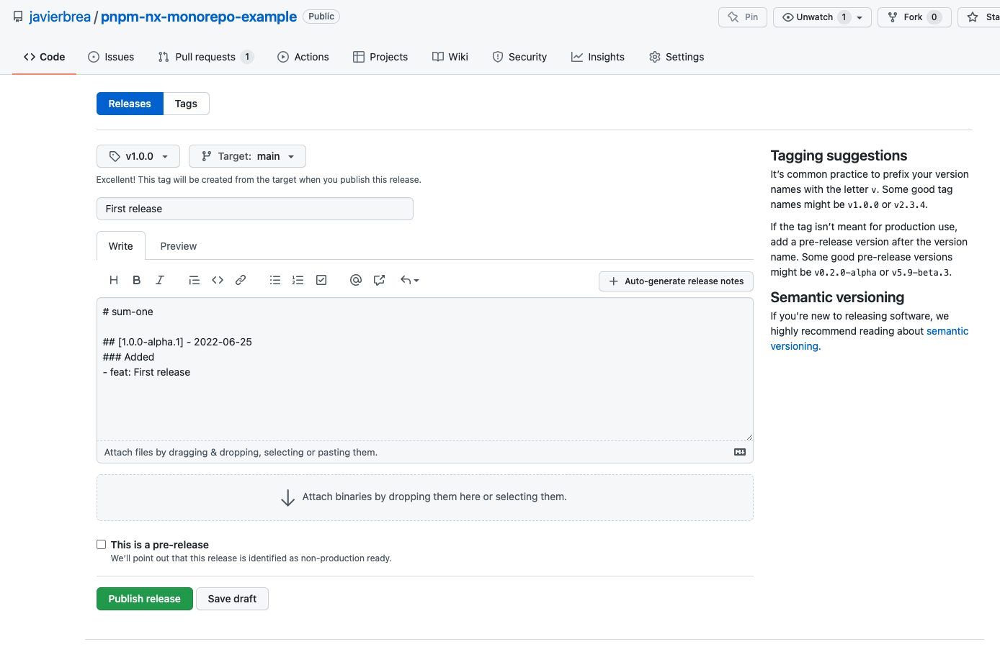

And the packages will be built and published automatically:

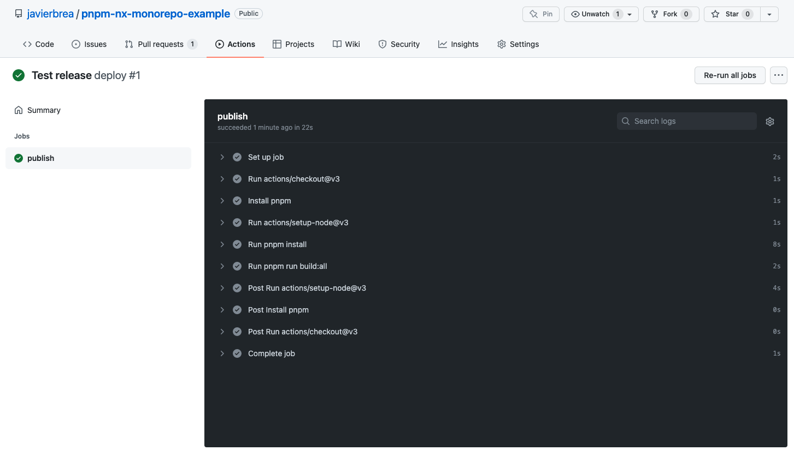

## Conclusion

In this post we have seen how to build a continuous integration workflow for a Pnpm and Nx monorepo using Github actions. Its branching model and pipeline stages are oriented to a repository containing NPM packages, but it can be easily adapted to any other type of projects.

We defined a set of requirements for the workflow. Let's make a short recap in order to check if all of them have been met:

* __Scalable__ - ✅  Any number of packages can be added without modifying the workflow.
* __Incremental__ - ✅ Only the affected packages are tested when a pull request is opened. Only the packages that are upgraded are published on the deploy step.
* __Fast__ - ✅ Parallel jobs are created dynamically for each task to be executed. The parallelization parameters can be easily modified to adjust performance.
* __Multi version__ - ✅ Tests are executed using multiple versions of Node.js
* __Multi platform__ - ✅ E2E tests are executed also on Windows OS
* __Automatic__ - ✅ Tests are executed whenever a pull request is opened. The deployment is executed when creating a new release on Github.
* __Blocker__ - ✅ Github actions status checks are required before allowing to merge a pull request.

There are still some points that could be improved. I have omitted them in order to keep the examples as simple as possible, but let's see some of them. I hope to explain them in coming posts:

* Cache of Pnpm dependencies between jobs.
* Check if the versions of publish affected packages have been upgraded properly when opening a pull request.
* Report coverage of unit testing.
* Do not test all of the projects in the `main` branch. Instead of that, the branch could be compared to the latest tag.

> Note: The examples of this post are available at [this Github repository](https://github.com/javierbrea/pnpm-nx-monorepo-example).

## Other post in this series

- [Why a monorepo? Requirements for a good workflow](/blog/pnpm-nx-monorepo-01/)
- [Building a Node.js monorepo using Pnpm and Nx](/blog/pnpm-nx-monorepo-02/)
- [CI/CD for Pnpm and Nx monorepo using Github actions](#)
